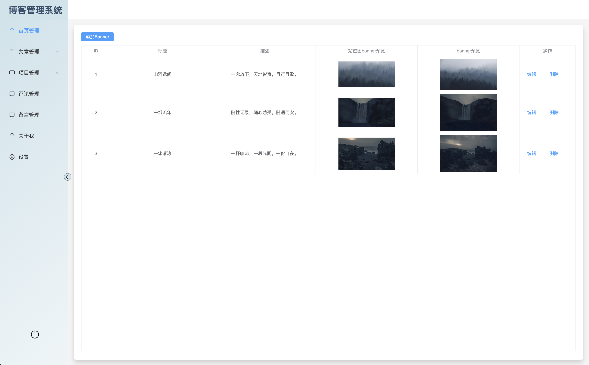
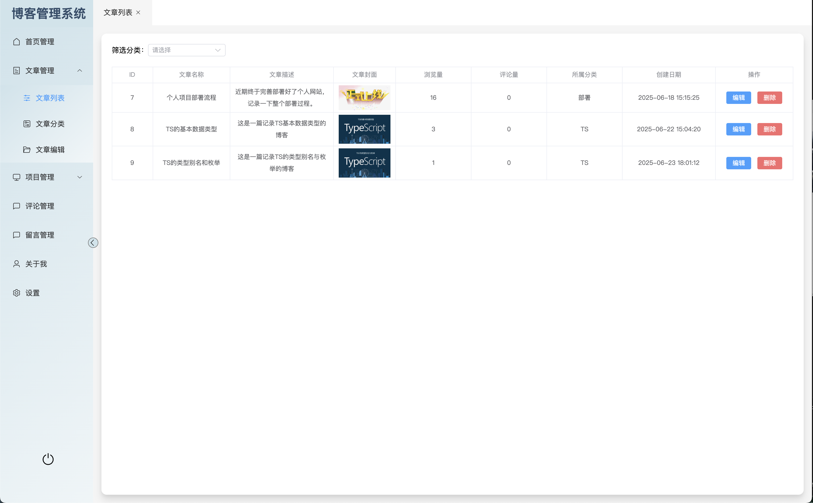
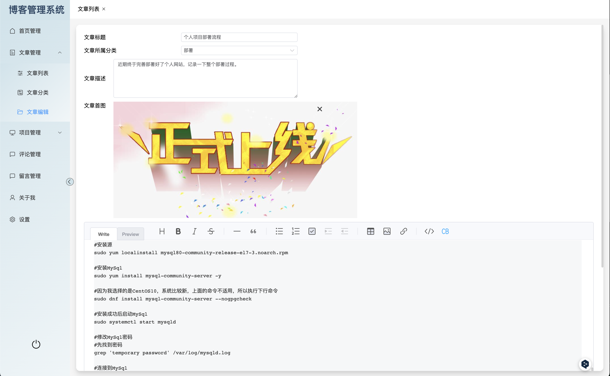

# 个人网站管理后台

基于 Vue 3 + Vite + Element Plus 构建的个人博客管理后台系统。

## 项目介绍

一个功能完善的个人博客后台管理系统，支持文章管理、项目展示、评论留言管理等功能

## 模块介绍

### 首页管理

-   Banner 轮播图管理
-   首页内容配置
-   数据统计展示

### 文章管理

-   **文章列表**：文章的增删改查操作
-   **文章分类**：分类的创建和管理
-   **文章编辑**：支持富文本编辑，Markdown 语法
-   代码高亮显示
-   图片上传功能

### 项目管理

-   **项目列表**：项目展示管理
-   **项目编辑**：项目信息的完整编辑
-   项目图片和描述管理

### 评论管理

-   **评论管理**：查看和管理用户评论
-   **留言管理**：处理用户留言信息

## 技术栈

### 前端框架

-   **Vue 3**
-   **Vite**
-   **Vue Router**
-   **Pinia**

### UI 组件库

-   **Element Plus**：基于 Vue 3 的桌面端组件库
-   **Element Plus Icons**：Element Plus 图标库
-   **Toast UI Editor**：富文本编辑器

## 项目结构

```
mysite-console/
├── public/                 # 静态资源
│   └── logo.png           # 项目 Logo
├── src/
│   ├── api/               # API 接口管理
│   │   ├── common.js      # 通用 API
│   │   └── http.js        # HTTP 请求封装
│   ├── assets/            # 静态资源
│   │   └── css/           # 样式文件
│   ├── components/        # 通用组件
│   │   ├── base/          # 基础组件
│   │   │   ├── Editor.vue # 富文本编辑器
│   │   │   └── Upload.vue # 文件上传组件
│   │   └── layout/        # 布局组件
│   │       ├── aside/     # 侧边栏
│   │       └── nav/       # 导航栏
│   ├── config/            # 配置文件
│   │   ├── api.config.js  # API 配置
│   │   ├── aside.config.js # 侧边栏配置
│   │   └── base.config.js # 基础配置
│   ├── router/            # 路由配置
│   ├── store/             # 状态管理
│   ├── utils/             # 工具函数
│   ├── views/             # 页面视图
│   │   ├── home/          # 首页管理
│   │   ├── article/       # 文章管理
│   │   ├── project/       # 项目管理
│   │   ├── comment/       # 评论管理
│   │   ├── message/       # 留言管理
│   │   ├── about/         # 关于我
│   │   ├── config/        # 设置
│   │   ├── login/         # 登录页
│   │   └── layout/        # 布局页
│   ├── App.vue            # 根组件
│   └── main.js            # 入口文件
├── index.html             # HTML 模板
├── package.json           # 项目配置
├── vite.config.js         # Vite 配置
└── README.md              # 项目说明
```

## 项目截图




